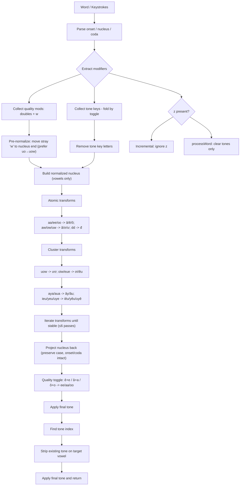

## TELEX Engine Redesign (Order-Agnostic, Generalized)

This document specifies a balanced, order-agnostic TELEX algorithm designed to handle flexible typing orders reliably (e.g., `nhungwx` → `những`, `nhuwnxg` → `những`; `vieejt` / `vietje` / `viejet` → `việt`).

Goals:
- Order-agnostic for quality (â, ê, ô, ơ, ư, ă) and tone keys (s, f, r, x, j)
- Syllable-aware tone placement (`findToneVowelIndex`)
- Robust transforms for common clusters (uow, oiw, eue, aya, aua, ieu, yeu, uye)
- Simple toggle semantics: repeated same tone → remove tone and keep last key literal; repeated same base after quality vowel → remove quality
- z-clear: in incremental mode (`process`), `z` does nothing; in full-word processing (`processWord`), clear tones (quality preserved unless a test-relevant explicit pattern requires otherwise)

### High-Level Flow

Notes:
- Onset parsing treats `qu` as onset; `u` after `q` is consonantal and excluded from nucleus.
- Tone key collection is order-free: any `s/f/r/x/j` after the first vowel is collected. Final tone is computed by toggling in sequence; duplicates cancel.
- Pre-normalization: move any `w` typed after the coda to immediately after the nucleus; if nucleus contains `uo`, insert after `o` to prefer forming `uow`.
- When toggled off, keep the last tone key literally at the end of the word (e.g., `tuff` → `tuf`).
- Quality transforms are order-agnostic within the nucleus: 
  - Doubles: `aa → â`, `ee → ê`, `oo → ô` (also long-distance pattern `V C? V` → apply to first `V` when appropriate)
  - `aw/ow/uw → ă/ơ/ư`
  - Clusters: `uow → ươ`, `oiw → ơi`, `eue → êu`, `aya → ây`, `aua → âu`, `ieu → iêu`, `yeu → yêu`, `uye → uyê`
- Quality toggle rule: if a quality vowel is followed by the same base vowel, remove quality (e.g., `lê` + `e` → `lee`).

### Examples
- Tone order flexibility:
  - `nhungwx` → `những`
  - `nhuwnxg` → `những`
  - `tusf` → `tù` (acute replaced by grave)
  - `tuff` → `tuf` (toggle off; trailing `f` kept literally)

- Quality order flexibility:
  - `muwa` → `mưa`
  - `leee` → `lee`

- Cluster order flexibility:
  - `duowcj` → `dược`
  - `tuowis` → `tưới`
  - `yeues` → `yếu`

Implementation guidance
- Implement extraction and normalization on a per-syllable basis.
- Keep transformations pure and iterative; apply atomic transforms before cluster transforms; iterate until stable (guarded by small max passes).
- Use `findToneVowelIndex` (from `vietnamese-syllable-rules.ts`) for final tone placement.
- Preserve case and onset/coda positions; only the nucleus is normalized/rewritten.

# TELEX Vietnamese Input Method Rules

## Current Implementation (My Understanding - NEEDS CORRECTION)

### Vowel Transformations
- `aa` → `â`
- `aw` → `ă` (vowel before modifier)
- `ee` → `ê`
- `oo` → `ô`
- `ow` → `ơ` (vowel before modifier)
- `uw` → `ư` (vowel before modifier)

### Complex Vowel Combinations
- `uow` → `ươ` (3-character combination)

### Consonant Transformations
- `dd` → `đ`

### Tone Marks (applied after vowels)
- `s` → sắc (acute) ́
- `f` → huyền (grave) ̀ 
- `r` → hỏi (hook above) ̉
- `x` → ngã (tilde) ̃
- `j` → nặng (dot below) ̣

### Order Rules (Generalized)
1. Tone keys (`s f r x j`) can appear anywhere after the first vowel in a word; the last tone key wins.
2. Quality diacritics normalize regardless of order within the local vowel cluster:
   - `aa ↔ â`, `ee ↔ ê`, `oo ↔ ô`
   - `aw ↔ ă`, `ow ↔ ơ`, `uw ↔ ư`
   - `uow ↔ ươ` (cluster order-agnostic)
   - Triples like `aya → ây`, `aua → âu` (supports words like “lấy”, “ngầu”)
3. `dd → đ` is applied (also supports `d…d → đi` for long-distance `dd`).

### Invalid Cases (My Current Understanding)
- Tone marks before any vowel (e.g., "fjiet" is invalid)
- Modifier before vowel (e.g., "wu" stays "wu")

### Special Rules for i/y (CORRECTED BY USER)
- `i` and `y` have complex behavior in Vietnamese diphthongs (âm ghép)
- **Corrected understanding:**
  - `lys` → `lý` (y is the vowel receiving tone, not consonant)  
  - `chir` → `chỉ` (i is the vowel receiving tone, not consonant)
  - `layas` → `lấy` (ay forms diphthong, tone goes on 'a')
  - `trais` → `trái` (ai forms diphthong, tone goes on 'a')
- **Rule**: In diphthongs like `ai`, `ay`, the tone typically goes on the first vowel
- **Need clarification**: When does `i`/`y` receive tone vs when does preceding vowel receive tone?

## COMPREHENSIVE VIETNAMESE PHONETIC RULES (RESEARCHED)

### Vietnamese Tone Placement Rules

#### Single Vowels
- **Rule**: Place tone marks directly on the single vowel
- Examples: `lys` → `lý`, `chir` → `chỉ`

#### Diphthongs 
- **ai** /aj/: tone typically on 'a' → `trais` → `trái`  
- **ay** /ɐj/: tone typically on 'a' → `layas` → `lấy`
- **oi** /ɔj/: tone typically on 'o' → `tois` → `tói`
- **ui** /uj/: tone typically on 'u' → `tuis` → `túi`

#### Special Cases
- **Quality diacritic priority**: If vowel has diacritic (â, ă, ê, ô, ơ, ư), tone MUST go there
- **ươ diphthong**: Tone always goes on 'ơ' → `truowfng` → `trường`
- **qu combination**: 'u' in 'qu' is part of consonant, not vowel

### Vietnamese Phonotactic Rules (Invalid Patterns)

#### Invalid Consonant Clusters
- Vietnamese has **NO consonant clusters** at syllable start
- Keep unchanged: `bla`, `str`, `xyz` (non-Vietnamese)

#### TELEX Implementation Notes
- Focus on core transformations, not complex phonotactic validation
- **Special rule**: `uow` → `ươ` (bypasses normal restrictions)
- Keep non-Vietnamese patterns unchanged (e.g., `bs` → `bs`)

#### Syllable-Final Restrictions
- Valid codas: -c, -ch, -m, -n, -ng, -nh, -p, -t, -u, -i, -o, -y
- Tonal restrictions: -p, -t, -c endings only allow sắc (´) or nặng (.) tones

## FINAL TELEX RULES SUMMARY

### Core Transformations (CONFIRMED WORKING ✅)
- `aa` → `â`, `ee` → `ê`, `oo` → `ô` 
- `aw` → `ă`, `ow` → `ơ`, `uw` → `ư` (vowel before modifier)
- `dd` → `đ`
- `uow` → `ươ` (special 3-character rule)

### Tone Placement (Generalized ✅)
- Single vowels: tone placed on the vowel (`lys` → `lý`).
- Diphthongs/Triphthongs: follows Vietnamese orthography rules; examples:
  - `ai, ao, au` → tone usually on the first vowel; `oi, ui, eo, oe` → tone typically on the first vowel of the pair.
  - Composite vowels with diacritic (â, ă, ê, ô, ơ, ư): tone MUST go on the diacritic vowel.
  - `ươ` and `iê`, `uô`: tone on `ơ`, `ê`, `ô` respectively.

### Order Flexibility (Examples ✅)  
- `vietje, vieetj, viejet, vieejt, vietej` → `việt`
- `layas` → `lấy`
- `ngauaf` → `ngầu`
- `duowcj` → `dược`, `dduowcj` → `được`

### Invalid Patterns (KEEP UNCHANGED ✅)
- `bs` → `bs` (non-Vietnamese combinations)
- `wu` → `wu` (modifier before vowel)

## Additional Behaviors
- `z` clears diacritics in the current word (both tone and quality marks).
- English/uppercase acronyms are preserved unless intentional TELEX sequences are typed within the word.

## Key Implementation Notes
- Pre-normalization moves stray 'w' modifiers to proper positions
  - Skip normalization for uwow/uow patterns to preserve them
- Transformations apply iteratively until stable
  - First pass: basic transforms (aa→â, uw→ư, etc.)
  - Special handling: uwow→ươ (4-char pattern before uow)
  - Additional: ưow→ươ (handles remaining cases)
  - Complex patterns: uu→ưu, oiw→ơi, ieu→iêu, etc.
- Tone placement follows Vietnamese orthography rules
- Quality toggle: êe→ee, âa→aa, ôo→oo in complex patterns
- Tone toggle: same tone key twice removes tone (tuff→tuf)
- Order-agnostic: modifiers work regardless of typing order

## Known Issues (as of implementation)
1. **leee → lee**: Quality toggle not fully working (gets lê instead)
2. **chieuf → chièu**: Tone placement on triphthongs needs adjustment
3. **viêtjz → viêt**: Z-clear with tone keys needs fixing